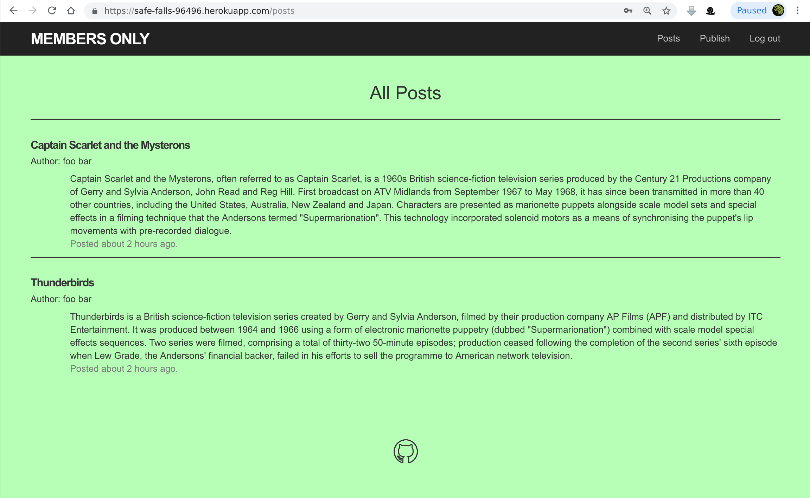

# Members Only Rails app:

Simon Tharby's solution to [Project 2: Members Only!](https://www.theodinproject.com/courses/ruby-on-rails/lessons/authentication?ref=lnav), Authentication section, Ruby on Rails unit, Odin Project.

[View in browser](https://safe-falls-96496.herokuapp.com) Please allow 20 seconds for free server to spin up.

Note: To log in (on Heroku app), use;
email: 'foo@bar.com'
password: 'foobar'

## Assignment instructions:

"In this project, you’ll be building an exclusive clubhouse where your members can write embarrassing posts about non-members. Inside the clubhouse, members can see who the author of a post is but, outside, they can only see the story and wonder who wrote it." ... + [more explicit guidance](https://www.theodinproject.com/courses/ruby-on-rails/lessons/authentication?ref=lnav).

In summary, the exercise requires the construction of a login page, an index of user posts where only logged-in users can see the name of the post authors, and the respective routes, models and controllers these require (including session cookies to 'remember' a logged-in user). The key concepts are the use of a secure password digest method, a browser cookie 'remember user login' method (with secure remember token digest), and limiting access to certain functions (esp: viewing post author names) to signed-in users only.

## My implementation:

As well as addressing the assignment requirements I also enforced SSL use on the Heroku server (for this app), implemented tests of all models and controllers, and added integration tests (including for attempted new post creation).

I added changes to the visibility of links in the header, dependent on login status. 'Publish' (links to posts/new) and 'Log out' are visible only when logged in, 'Log in' is visible only when logged out.

Root = posts_path.

Attempting to access posts/new when not logged in will redirect to the login_path.

Submitting invalid form data results in an appropriate error flash message (for both the login and new post forms) + details of the errors (new post forms).

## Screenshots:

Home page = Posts index (with author names hidden to non-logged-in-user):


Home page = Posts index (with author names shown to logged-in-user):



Login page, showing form submission errors:


New post form, showing form submission errors:


Login page, showing error after redirect, triggered by attempted navigation to 'posts/new' by non-logged-in-user:


## Things I didn't know / immediately remember, but worked out:

Although including bootstrap and related CSS improves styling, to get the text input fields and login buton to scale nicely to the page, etc. required inserting (and editing):

app/views/layouts/\_rails_default.html.erb
app/views/layouts/\_shim.html.erb
(and altering their contents from the [railstutorial.org](https://www.railstutorial.org/book/) versions as appropriate / desired)

and editing app/views/layouts/\_application.html.erb to taste.

Need to enforce SSL on Heroku (if deploying to Heroku) to ensure proper security of login / authentication.

## Getting started:

To get started with the app, clone the repo and then install the needed gems:

```
$ bundle install --without production
```

Next, migrate the database:

```
$ rails db:migrate
```

Finally, run the test suite to verify that everything is working correctly:

```
$ rails test
```

If the test suite passes, you'll be ready to run the app in a local server:

```
$ rails server
```
